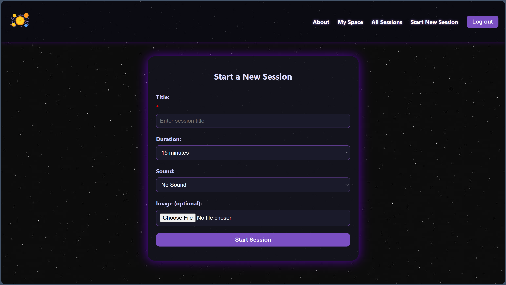
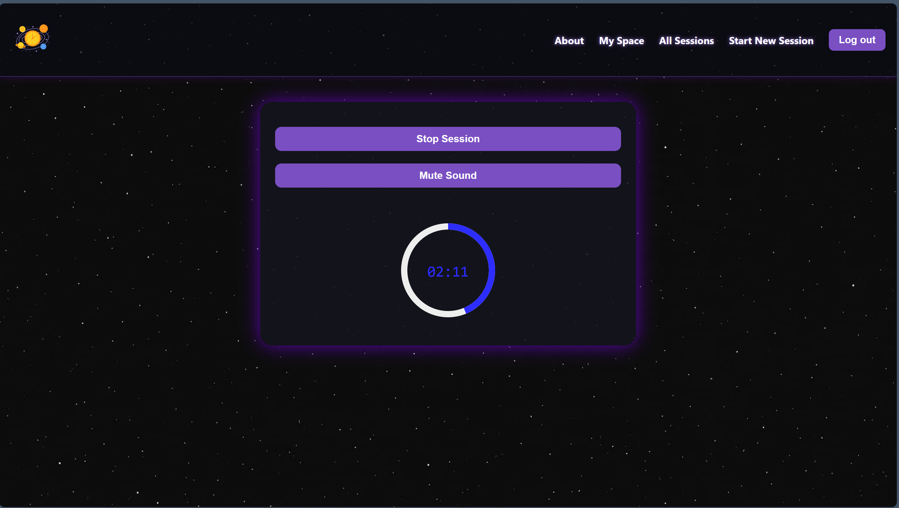
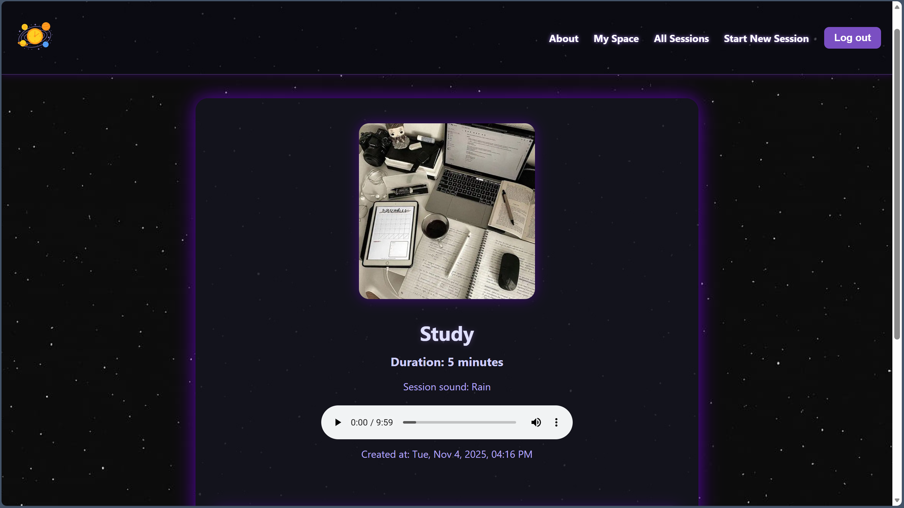
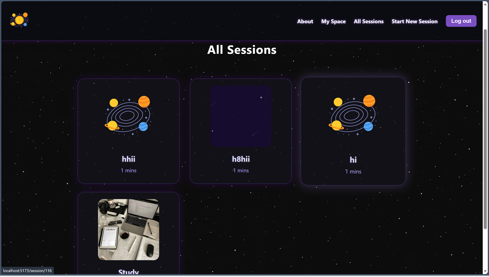
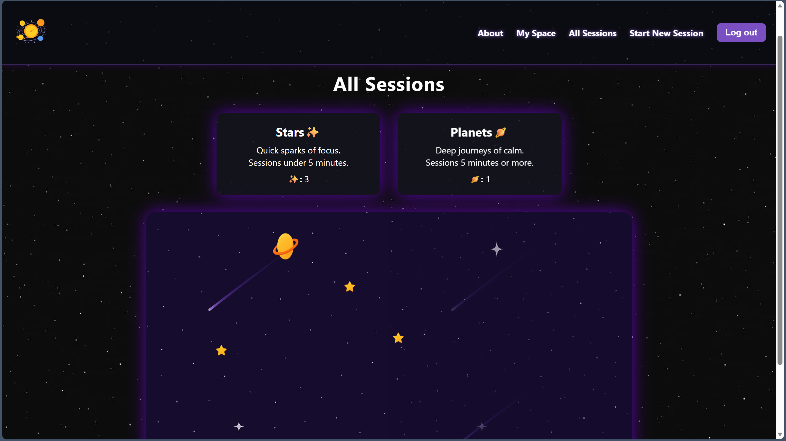

<p align="center">
  
</p>

# Space Frontend

A responsive and immersive frontend interface for managing focus sessions, tasks, and visualizing progress through a cosmic space view. Built with React, this app allows users to create timed sessions, assign tasks, and explore their productivity in a playful, visual way.

---

## Project & Repository Description

This repository contains the **frontend** codebase for the Space application.  
It handles:

- User authentication (signup/login)
- Session and task management
- Real-time session countdown with optional sound
- A space-themed visualization of sessions
- Responsive UI for desktop and mobile

---

## Tech Stack

| Layer         | Technology                     |
|---------------|--------------------------------|
| Framework     | React                          |
| Routing       | React Router                   |
| Styling       | CSS Modules                    |
| State         | useState + localStorage        |
| Auth          | JWT (via backend API)          |
| Deployment    | Docker-ready                   |

---
### Preview

<p align="center">  
   
   
   
  
  

</p>

## Responsive Design

The Space Frontend is fully responsive and mobile-friendly.  
It automatically adapts to different screen sizes — from large desktops to small mobile devices — ensuring a smooth and intuitive experience across all platforms.

- Mobile-first layout
- Touch-friendly buttons and controls
- Adaptive session view and task cards
- Optimized for both portrait and landscape modes


## Backend Repository
You can find the backend API here:  [Backend](https://github.com/alanod455/backend-space--app)


## Installation Instructions (Docker)

To run the frontend locally using Docker:

# Clone the repository
```
git clone https://github.com/your-org/focusflow-frontend.git
cd focusflow-frontend
```
# Build and run the container
```
docker build -t focusflow-frontend .
docker run -p 8000:8000 focusflow-frontend
```

The app will be available at [Frontend](http://localhost:8000)

## IceBox Features

These features are planned but not yet implemented:

- Pause/Resume session timer  
- Analytics dashboard for session history  
- Light mode toggle  
- Notification reminders before session ends  
- AI-generated task suggestions  
- Interactive space animations with sound effects  
- PWA support for offline use  

---

Built with 💜 by a Alanoud Almarshad
